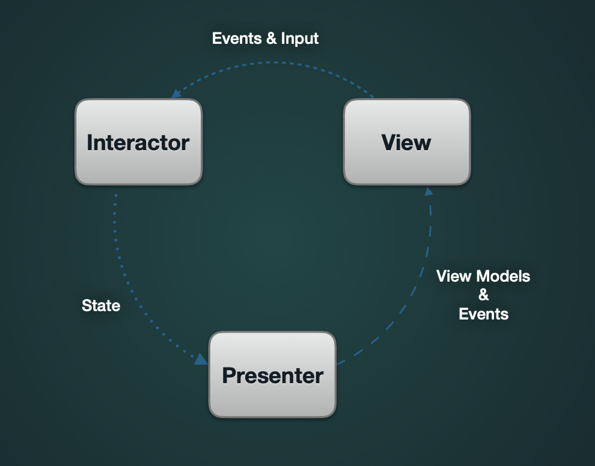
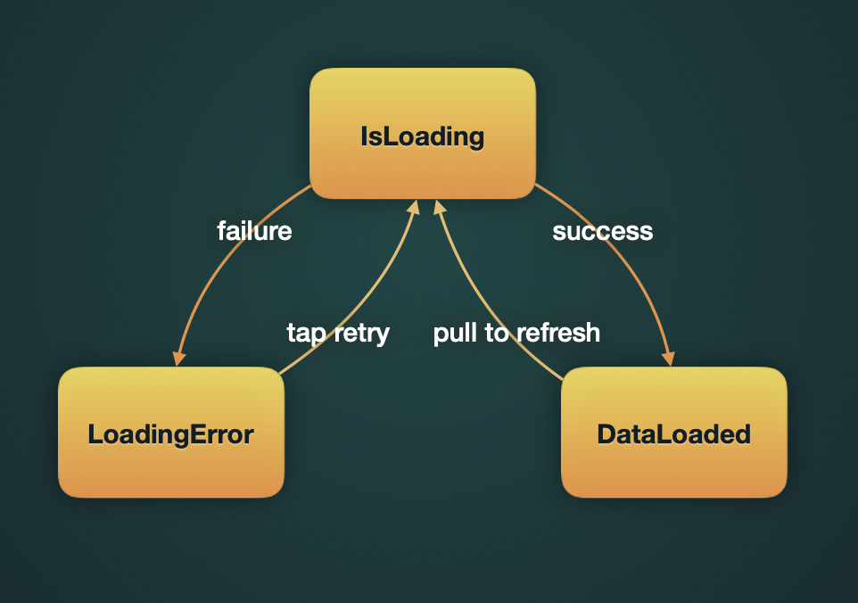

# StatefulScreenExample

Example of Profile screen with State and Unidirectional Data Flow. 
Interactor, Presenter and View are binded with RxSwift.

Profile module has 2 ViewControllers. They look equally, but are implemented in diffrent ways: first with TableView, and second with StackView. Interactor & Presenter are the same. This is made to demonstrate that this concept allows us to use different view implementations. It can be useful for layout A/B testing, for example.

Firstly, install frameworks via carthage: carthage update --platform iOS --cache-builds

### StateDiagram:

